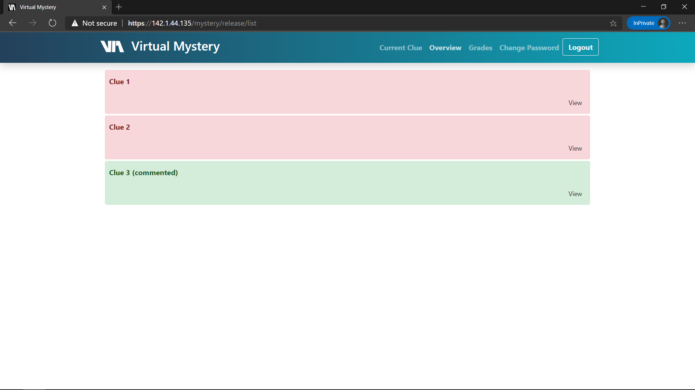
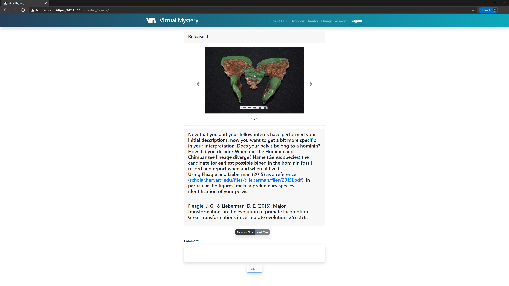
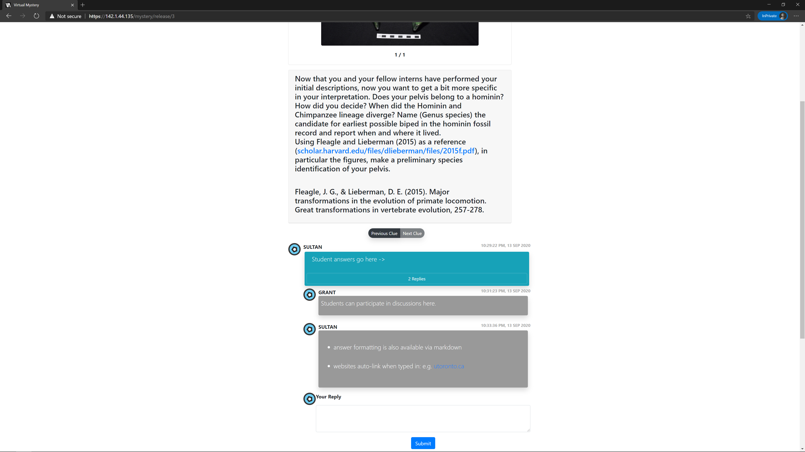

# virtual-mystery
Application for delivering for Virtual Mystery assignments in courses.

# sitemap
* [docs](https://github.com/utmandrew/virtual-mystery/tree/master/docs): setup guides and documentation
* [src](https://github.com/utmandrew/virtual-mystery/tree/master/src): application site root

## screenshots
Some screenshots of Virtual Mystery:
- Login screen 
- Home page 
- Clue submission 
- Comment and reply system 
