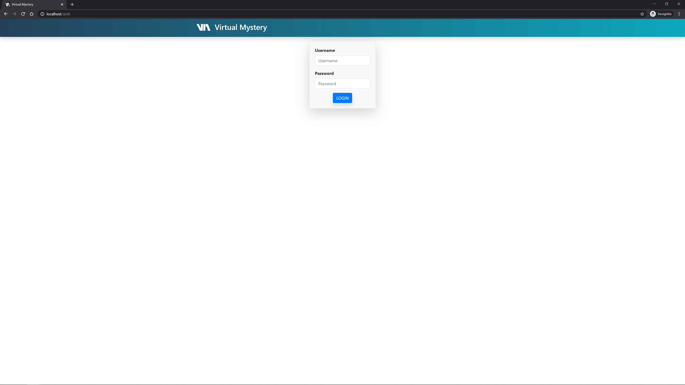

# virtual-mystery
Application for delivering for Virtual Mystery assignments in courses.

# sitemap
* [docs](https://github.com/utmandrew/virtual-mystery/tree/master/docs): setup guides and documentation
* [src](https://github.com/utmandrew/virtual-mystery/tree/master/src): application site root

## screenshots
Virtual Mystery looks like this:

