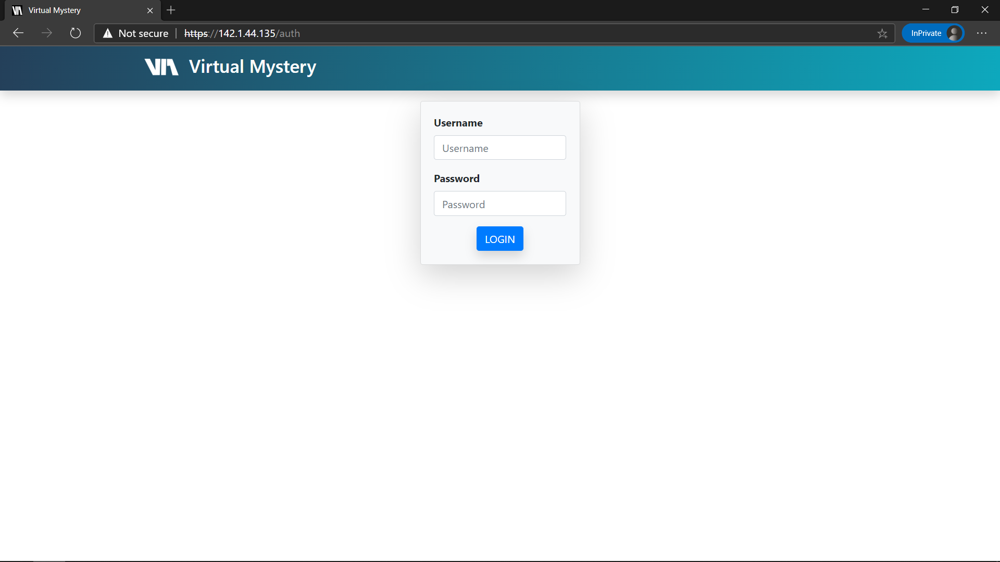

# virtual-mystery
Application for delivering for Virtual Mystery assignments in courses.

# sitemap
* [docs](https://github.com/utmandrew/virtual-mystery/tree/master/docs): setup guides and documentation
* [src](https://github.com/utmandrew/virtual-mystery/tree/master/src): application site root

## screenshots
Some screenshots of Virtual Mystery:
- **Login screen** 
- **Home page** 
- **Clue submission** 
- **Comment and reply system** 
- **TA view** 
- **TA grading view** 
- **Student results view** 
- **Password reset screen** 
